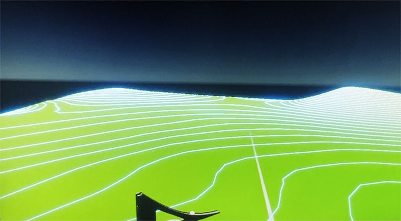

# VR putting practice
## Using VR to enhance human performance in golf

Knowing how the ground undualtes is important in putting. In order to learn how a green "breaks," it's important to spend time on that green rolling putts. The problem is that most golf courses do not let players linger on greens for their own practice. Other players are on the course, and play must remain at a constant pace. In tournament golf, courses offer practice rounds prior to a tournamnent. This is an opportunity for players to study the course, but is also limited in time and requires players to travel to a course days before the tournament. So, how do we study individual greens given that we have limited access to them? Would it be possible to explore real greens virtually? Can VR offer an effective surrogate for real greens, allowing players to memorize breaks without physically standing on them?

Additionally, there could be ways of presenting the terrain that are specific to VR. If we think of each model as a kind of data display, how can we visualize the terrain to best suit golfers who want to learn how balls roll on specific greens? What kind of data can be overlayed to enhance a players understanding beyond reality. Beyond the ability to virtually roll balls, visual strategies such as depth maps, countrour lines, exagerated undulations, and many other methods might provide a deeper understanding of each green.

The process would go something like this: Scan a green. Import and clean the model. Wrap a VR experience around the models that allows players to see the green in novel ways that enhance their understanding of the terrain.

Of particular interest here is the ability to scan greens with an ordinary device such as a smartphone or tablet. This has the potential to bring virtual practice to any public course.

## Tech

- [Unity 2020.3.26f1] - Custom shaders and VR control in Unity
- [Polyscan] - Lidar mapping using iOS devices
- [Blender] - Cleaning and processing model to work in Unity
